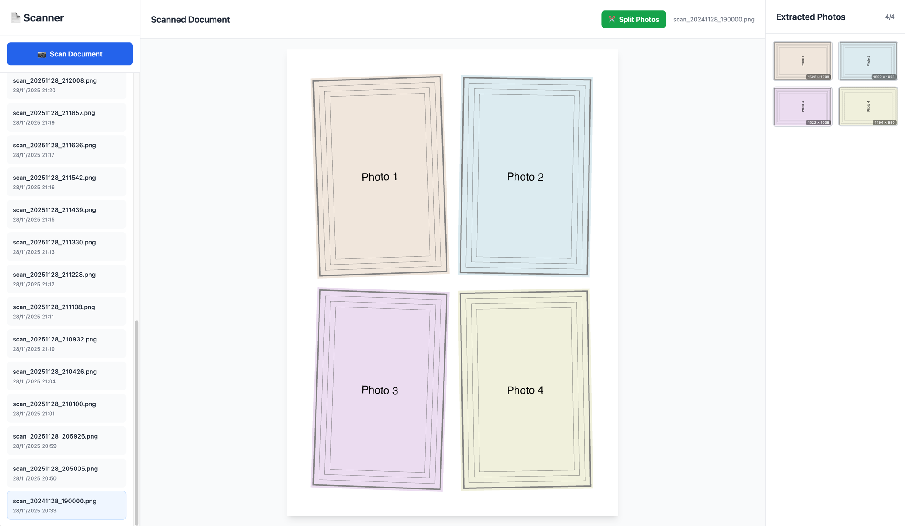

# Python Scan 4x4 - A4 Scanner to 2x2 Grid

A web application that scans A4 documents from a connected scanner and automatically splits them into a 2×2 grid (4 separate images).



## Project Status

✅ **Phase 2 Complete: Web Application**
- Multi-driver scanner support (SANE, eSCL, Apple)
- Smart edge detection for photo splitting
- Full web interface with real-time scanning
- Auto-split functionality after scanning

## Quick Start

### Prerequisites

1. **Install uv** (modern Python package manager):
```bash
curl -LsSf https://astral.sh/uv/install.sh | sh
```

2. **Install dependencies**:
```bash
cd python-scan-4x4
uv sync
```

### Usage

#### Web Application (Recommended)
```bash
# Start the web server
uv run python app.py

# Or use the shell script
./start_web.sh

# Open browser to: http://localhost:5000
```

Features:
- **Scan**: Click "Scan New Document" to scan from your scanner
- **Split**: Click "Split" on any scanned image to extract 4 photos
- **View**: Browse all scans and their split photos
- Real-time scanning progress
- Automatic scanner detection (eSCL/SANE/Apple drivers)

#### Command Line Tools

##### 1. Scan from Hardware Scanner
```bash
# Run scanner POC (requires physical scanner)
uv run poc_scan.py
# Creates: output/scans/scan_YYYYMMDD_HHMMSS.png
```

##### 2. Simulation Mode (No Scanner Required)
```bash
# Generate simulated scan
uv run simulate_scan.py
# Creates: output/scans/simulated_scan_YYYYMMDD_HHMMSS.png
```

##### 3. Smart Split Image
```bash
# Split using edge detection
uv run smart_split.py output/scans/scan_20241128_183755.png
# Creates: photos/scan_20241128_183755_photo_1.png (etc.)
```

##### 4. Test Edge Detection
```bash
# Debug edge detection
uv run test_smart_split.py output/scans/scan_20241128_205005.png
# Creates visualization images showing detection process
```

## Features

### Current (Phase 2 - Complete)
- ✅ **Web Application** with three-panel interface (Tailwind CSS)
- ✅ **Multi-Driver Support**: eSCL, SANE, Apple ImageKit, Windows WIA
- ✅ **Smart Edge Detection**: Automatically detects photo boundaries
- ✅ **Auto-Rotation**: Straightens misaligned photos
- ✅ **Real-time Progress**: Scanning status updates
- ✅ Scan A4 documents at 300 DPI
- ✅ Automatic Flatbed source selection
- ✅ PNG output format with DPI metadata
- ✅ Simulation mode for testing without hardware

### Upcoming (Phase 3-5)
- 🔲 Batch scanning queue
- 🔲 Advanced image adjustments (brightness, contrast)
- 🔲 Multiple output formats (JPEG, TIFF, PDF)
- 🔲 Cloud storage integration
- 🔲 Mobile responsive design

## Output

### Scanned Image
- **Format**: PNG
- **Resolution**: 2480 × 3508 pixels (A4 @ 300 DPI)
- **Size**: ~100-500 KB (simulated), ~5-25 MB (real scan)

### Split Images
Each quadrant is split into equal parts:
- **Quadrant 1**: Top-left (1240 × 1754 pixels)
- **Quadrant 2**: Top-right (1240 × 1754 pixels)
- **Quadrant 3**: Bottom-left (1240 × 1754 pixels)
- **Quadrant 4**: Bottom-right (1240 × 1754 pixels)

## Project Structure

```
python-scan-4x4/
├── app.py                  # Flask web application ✅
├── scan_and_split.py       # Backend scanning logic ✅
├── smart_split.py          # Edge detection & splitting ✅
├── scanners/               # Scanner drivers
│   ├── __init__.py        # Scanner manager
│   ├── base.py            # Base driver interface
│   ├── sane_driver.py     # SANE backend (Linux/macOS)
│   ├── escl_driver.py     # eSCL/AirPrint (network scanners) ✅
│   ├── apple_driver.py    # Apple ImageKit (macOS)
│   └── wia_driver.py      # Windows Image Acquisition
├── templates/
│   └── index.html         # Web UI (Tailwind CSS) ✅
├── static/
│   └── styles.css         # Custom styles
├── output/
│   ├── scans/             # Scanned images
│   └── debug/             # Debug visualizations
├── photos/                # Split photo output ✅
├── docs/                  # Documentation
├── poc_scan.py            # Scanner CLI tool ✅
├── simulate_scan.py       # Simulation mode ✅
├── test_smart_split.py    # Edge detection testing ✅
└── pyproject.toml         # Dependencies (uv)
```

## Technology Stack

### Backend
- **Python 3.13+**: Core language
- **uv**: Modern package manager (fast, reliable)
- **Flask**: Web framework
- **Pillow (PIL)**: Image processing
- **OpenCV**: Edge detection and computer vision
- **NumPy**: Numerical operations

### Scanner Drivers
- **eSCL**: Network/AirPrint scanners (HTTP-based)
- **SANE**: Traditional scanner backend (Linux/macOS)
- **Apple ImageKit**: Native macOS scanning
- **WIA**: Windows Image Acquisition (planned)

### Frontend
- **Tailwind CSS**: Utility-first CSS framework
- **Vanilla JavaScript**: No framework dependencies
- **Fetch API**: Real-time updates

## Scanner Drivers

The application automatically selects the best available scanner driver:

### eSCL Driver (Recommended)
- Works with network scanners (AirPrint compatible)
- HTTP-based protocol
- Returns PNG images directly
- No system dependencies required

### SANE Driver
- Traditional Linux/macOS scanner backend
- Requires `sane-backends` installation
- Supports USB and network scanners
- May have I/O issues with some network scanners

### Apple ImageKit Driver
- Native macOS scanning framework
- Best integration with Apple scanners
- Requires macOS 10.15+

### Windows WIA Driver (Planned)
- Native Windows scanning
- Will support USB and network scanners

The web app and CLI tools automatically detect and use the first available scanner.

## Smart Edge Detection

The smart splitting algorithm uses computer vision to detect individual photos:

### Features
- **Edge Detection**: Uses Canny edge detection
- **Contour Analysis**: Finds rectangular photo boundaries
- **Auto-Rotation**: Corrects misaligned photos using perspective transform
- **Adaptive Thresholds**: Adjusts for different lighting conditions

### Algorithm Steps
1. Convert to grayscale
2. Apply Gaussian blur to reduce noise
3. Canny edge detection
4. Find contours and filter by area
5. Approximate contours to rectangles
6. Sort by position (top-left, top-right, bottom-left, bottom-right)
7. Extract and rotate each photo

### Debug Mode
```bash
# Test edge detection with visualization
uv run test_smart_split.py output/scans/your_scan.png

# Creates debug images showing:
# - Detected edges
# - Identified contours
# - Bounding boxes
# - Final extracted photos
```

## Examples

### Example 1: Web Application
```bash
# Start server
uv run python app.py

# Open browser: http://localhost:5000
# Click "Scan New Document"
# Wait for scan to complete
# Click "Split" to extract photos
# View individual photos in right panel
```

### Example 2: CLI Workflow
```bash
# Scan from command line
uv run poc_scan.py

# Smart split the result
uv run smart_split.py output/scans/scan_*.png

# View extracted photos
ls -lh photos/
```

### Example 3: Test Edge Detection
```bash
# Debug edge detection algorithm
uv run test_smart_split.py output/scans/scan_20251128_205005.png

# Check debug output
open output/debug/scan_20251128_205005_*.png
```

## Troubleshooting

### "No scanners detected"
The app tries multiple drivers in order:
1. **eSCL**: Check scanner is on the network and supports AirPrint
2. **SANE**: Install `sane-backends` and verify with `scanimage -L`
3. **Apple**: macOS only, requires ImageKit support
4. **Fallback**: Use simulation mode with `simulate_scan.py`

### "Error during device I/O" (SANE)
This is a known issue with SANE and network scanners. Solutions:
1. Use eSCL driver instead (recommended for network scanners)
2. Wake scanner: `scanimage -L` before running
3. Check USB connection if using USB scanner
4. Restart scanner and try again

### Edge detection not finding photos
1. Ensure photos have clear edges against the background
2. Check photos are well-lit and not overexposed
3. Run `test_smart_split.py` to see debug visualization
4. Adjust thresholds in `smart_split.py` if needed

### Web UI not loading scans
1. Check `output/scans/` directory exists and has write permissions
2. Check browser console for JavaScript errors
3. Verify Flask is running on port 5000

## Documentation

See the `docs/` folder for detailed documentation:
- **PROJECT_PLAN.md**: Complete project roadmap
- **POC_GUIDE.md**: Detailed scanner POC implementation
- **IMAGE_SPLITTING_GUIDE.md**: Image processing details
- **WEB_APP_DESIGN.md**: Future web application design

## Next Steps

1. ✅ Phase 1: POC Complete
2. ✅ Phase 2: Web Application Complete
3. 🔄 Phase 3: Refinements
   - Improve edge detection accuracy
   - Add batch scanning support
   - Better error handling
4. 📋 Phase 4: Advanced Features
   - Image adjustments (brightness, contrast, rotation)
   - Multiple output formats
   - Cloud storage integration
5. 📋 Phase 5: Production Deployment
   - Docker containerization
   - Authentication
   - Multi-user support

## Contributing

This project is currently in POC phase. Focus areas:
- Testing with different scanner models
- Improving image quality handling
- Adding error handling for edge cases

## License

TBD

## Author

Created as a proof of concept for A4 document scanning and splitting workflow.
